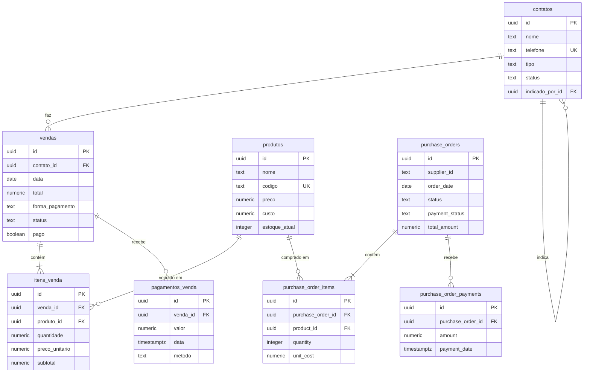

# DATABASE.md

## 📊 Schema Completo do Supabase

**Projeto:** Mont Distribuidora — Catálogo Público  
**Database:** `[SUPABASE_PROJECT_ID].supabase.co`

---

## 🗂️ Tabelas do Schema `public`

### 1. `produtos`

Produtos disponíveis para venda.

| Coluna | Tipo | Constraints | Default | Descrição |
|--------|------|-------------|---------|-----------|
| `id` | `uuid` | PK | `gen_random_uuid()` | ID único |
| `nome` | `text` | NOT NULL | - | Nome do produto |
| `codigo` | `text` | UNIQUE, NOT NULL | - | Código SKU |
| `preco` | `numeric` | NOT NULL | - | Preço de venda |
| `custo` | `numeric` | NOT NULL | - | Custo de aquisição |
| `unidade` | `text` | NOT NULL | `'kg'` | Unidade (kg, un, cx) |
| `ativo` | `boolean` | NOT NULL | `true` | Produto ativo? |
| `estoque_atual` | `integer` | NULLABLE | `0` | Estoque atual |
| `estoque_minimo` | `integer` | NULLABLE | `10` | Estoque mínimo |
| `apelido` | `text` | NULLABLE | - | Apelido do produto |
| `criado_em` | `timestamptz` | NOT NULL | `now()` | Data de criação |
| `atualizado_em` | `timestamptz` | NOT NULL | `now()` | Última atualização |

**Indexes:**
- `produtos_pkey` (PK): `id`
- `produtos_codigo_key` (UNIQUE): `codigo`

**Triggers:**
- `trigger_produtos_atualizado_em` (BEFORE UPDATE): Atualiza `atualizado_em`

---

### 2. `contatos`

Clientes e leads (B2C e B2B).

| Coluna | Tipo | Constraints | Default | Descrição |
|--------|------|-------------|---------|-----------|
| `id` | `uuid` | PK | `gen_random_uuid()` | ID único |
| `nome` | `text` | NOT NULL | - | Nome do contato |
| `telefone` | `text` | UNIQUE, NOT NULL | - | Telefone (WhatsApp) |
| `tipo` | `text` | CHECK | - | `'B2C'` ou `'B2B'` |
| `subtipo` | `text` | NULLABLE | - | Subtipo (ex: restaurante) |
| `status` | `text` | CHECK | `'lead'` | `'lead'`, `'cliente'`, `'inativo'` |
| `origem` | `text` | CHECK | `'direto'` | `'direto'` ou `'indicacao'` |
| `indicado_por_id` | `uuid` | FK → `contatos.id` | - | Quem indicou |
| `endereco` | `text` | NULLABLE | - | Endereço |
| `bairro` | `text` | NULLABLE | - | Bairro |
| `cep` | `text` | NULLABLE | - | CEP |
| `latitude` | `float8` | NULLABLE | - | Coordenada GPS |
| `longitude` | `float8` | NULLABLE | - | Coordenada GPS |
| `observacoes` | `text` | NULLABLE | - | Observações |
| `ultimo_contato` | `timestamptz` | NULLABLE | - | Último contato |
| `criado_em` | `timestamptz` | NOT NULL | `now()` | Data de criação |
| `atualizado_em` | `timestamptz` | NOT NULL | `now()` | Última atualização |

**Indexes:**
- `contatos_pkey` (PK): `id`
- `contatos_telefone_key` (UNIQUE): `telefone`
- `idx_contatos_tipo`: `tipo`
- `idx_contatos_status`: `status`
- `idx_contatos_indicado_por`: `indicado_por_id`

**Triggers:**
- `trigger_contatos_atualizado_em` (BEFORE UPDATE): Atualiza `atualizado_em`

---

### 3. `vendas`

Vendas realizadas (diretas e pré-vendas).

| Coluna | Tipo | Constraints | Default | Descrição |
|--------|------|-------------|---------|-----------|
| `id` | `uuid` | PK | `gen_random_uuid()` | ID único |
| `contato_id` | `uuid` | FK → `contatos.id` | - | Cliente |
| `data` | `date` | NOT NULL | `CURRENT_DATE` | Data da venda |
| `data_entrega` | `date` | NULLABLE | - | Data de entrega |
| `total` | `numeric` | NOT NULL | - | Total da venda |
| `custo_total` | `numeric` | NULLABLE | `0` | Custo total |
| `taxa_entrega` | `numeric` | NULLABLE | `0` | Taxa de entrega |
| `forma_pagamento` | `text` | CHECK | - | `'pix'`, `'dinheiro'`, `'cartao'`, `'fiado'`, `'brinde'`, `'pre_venda'` |
| `status` | `text` | CHECK | `'pendente'` | `'pendente'`, `'entregue'`, `'cancelada'` |
| `pago` | `boolean` | NULLABLE | `false` | Venda paga? |
| `valor_pago` | `numeric` | NULLABLE | `0` | Valor já pago |
| `parcelas` | `int2` | NULLABLE | `1` | Número de parcelas |
| `data_prevista_pagamento` | `date` | NULLABLE | - | Previsão de pagamento |
| `observacoes` | `text` | NULLABLE | - | Observações |
| `criado_em` | `timestamptz` | NOT NULL | `now()` | Data de criação |
| `atualizado_em` | `timestamptz` | NOT NULL | `now()` | Última atualização |

**Indexes:**
- `vendas_pkey` (PK): `id`
- `idx_vendas_contato`: `contato_id`
- `idx_vendas_data`: `data`
- `idx_vendas_status`: `status`

**Triggers:**
- `trigger_vendas_atualizado_em` (BEFORE UPDATE): Atualiza `atualizado_em`
- `trigger_stock_on_status_change` (AFTER UPDATE): Atualiza estoque ao mudar status

---

### 4. `itens_venda`

Itens de cada venda.

| Coluna | Tipo | Constraints | Default | Descrição |
|--------|------|-------------|---------|-----------|
| `id` | `uuid` | PK | `gen_random_uuid()` | ID único |
| `venda_id` | `uuid` | FK → `vendas.id` | - | Venda |
| `produto_id` | `uuid` | FK → `produtos.id` | - | Produto |
| `quantidade` | `numeric` | NOT NULL | - | Quantidade |
| `preco_unitario` | `numeric` | NOT NULL | - | Preço unitário |
| `custo_unitario` | `numeric` | NULLABLE | `0` | Custo unitário |
| `subtotal` | `numeric` | NOT NULL | - | Subtotal (qty * preço) |

**Indexes:**
- `itens_venda_pkey` (PK): `id`
- `idx_itens_venda_venda`: `venda_id`

---

### 5. `configuracoes`

Configurações do sistema (chave-valor JSON).

| Coluna | Tipo | Constraints | Default | Descrição |
|--------|------|-------------|---------|-----------|
| `id` | `uuid` | PK | `gen_random_uuid()` | ID único |
| `chave` | `text` | UNIQUE, NOT NULL | - | Chave da config |
| `valor` | `jsonb` | NOT NULL | - | Valor JSON |
| `atualizado_em` | `timestamptz` | NOT NULL | `now()` | Última atualização |

**Indexes:**
- `configuracoes_pkey` (PK): `id`
- `configuracoes_chave_key` (UNIQUE): `chave`

**Triggers:**
- `trigger_configuracoes_atualizado_em` (BEFORE UPDATE): Atualiza `atualizado_em`

---

### 6. `purchase_orders`

Pedidos de compra (reposição de estoque).

| Coluna | Tipo | Constraints | Default | Descrição |
|--------|------|-------------|---------|-----------|
| `id` | `uuid` | PK | `gen_random_uuid()` | ID único |
| `supplier_id` | `text` | NULLABLE | `'Fabricante'` | Fornecedor |
| `order_date` | `date` | NOT NULL | `CURRENT_DATE` | Data do pedido |
| `data_recebimento` | `timestamptz` | NULLABLE | - | Data de recebimento |
| `status` | `purchase_order_status` | NOT NULL | `'pending'` | `'pending'`, `'received'`, `'cancelled'` |
| `payment_status` | `purchase_order_payment_status` | NOT NULL | `'unpaid'` | `'paid'`, `'partial'`, `'unpaid'` |
| `total_amount` | `numeric` | NOT NULL | `0` | Total do pedido |
| `amount_paid` | `numeric` | NULLABLE | `0` | Valor já pago |
| `notes` | `text` | NULLABLE | - | Observações |
| `created_at` | `timestamptz` | NULLABLE | `now()` | Data de criação |
| `updated_at` | `timestamptz` | NULLABLE | `now()` | Última atualização |

**Indexes:**
- `purchase_orders_pkey` (PK): `id`

**RLS:** Habilitado (policy: "Enable all access")

---

### 7. `purchase_order_items`

Itens de cada pedido de compra.

| Coluna | Tipo | Constraints | Default | Descrição |
|--------|------|-------------|---------|-----------|
| `id` | `uuid` | PK | `gen_random_uuid()` | ID único |
| `purchase_order_id` | `uuid` | FK → `purchase_orders.id` | - | Pedido |
| `product_id` | `uuid` | FK → `produtos.id` | - | Produto |
| `quantity` | `integer` | CHECK > 0 | - | Quantidade |
| `unit_cost` | `numeric` | CHECK >= 0 | - | Custo unitário |
| `total_cost` | `numeric` | GENERATED | `qty * unit_cost` | Custo total (calculado) |

**Indexes:**
- `purchase_order_items_pkey` (PK): `id`

**RLS:** Habilitado (policy: "Enable all access")

---

### 8. `purchase_order_payments`

Pagamentos de pedidos de compra.

| Coluna | Tipo | Constraints | Default | Descrição |
|--------|------|-------------|---------|-----------|
| `id` | `uuid` | PK | `gen_random_uuid()` | ID único |
| `purchase_order_id` | `uuid` | FK → `purchase_orders.id` | - | Pedido |
| `amount` | `numeric` | NOT NULL | - | Valor pago |
| `payment_date` | `timestamptz` | NOT NULL | `now()` | Data do pagamento |
| `payment_method` | `text` | NULLABLE | `'pix'` | Método de pagamento |
| `notes` | `text` | NULLABLE | - | Observações |
| `created_at` | `timestamptz` | NOT NULL | `now()` | Data de criação |

**Indexes:**
- `purchase_order_payments_pkey` (PK): `id`
- `idx_purchase_order_payments_order_id`: `purchase_order_id`

**Triggers:**
- `tr_update_purchase_order_payment_status` (AFTER INSERT/UPDATE/DELETE): Atualiza `payment_status` do pedido

**RLS:** Habilitado (policy: "Enable all access for all users")

---

### 9. `pagamentos_venda`

Pagamentos de vendas (parciais ou totais).

| Coluna | Tipo | Constraints | Default | Descrição |
|--------|------|-------------|---------|-----------|
| `id` | `uuid` | PK | `gen_random_uuid()` | ID único |
| `venda_id` | `uuid` | FK → `vendas.id` | - | Venda |
| `valor` | `numeric` | CHECK > 0 | - | Valor pago |
| `data` | `timestamptz` | NOT NULL | `now()` | Data do pagamento |
| `metodo` | `text` | NOT NULL | `'pix'` | Método de pagamento |
| `observacao` | `text` | NULLABLE | - | Observações |
| `criado_em` | `timestamptz` | NOT NULL | `now()` | Data de criação |

**Indexes:**
- `pagamentos_venda_pkey` (PK): `id`

**Triggers:**
- `trigger_update_venda_pagamento` (AFTER INSERT/DELETE): Atualiza `valor_pago` e `pago` da venda

---

## 🔗 Diagrama de Relações

---

## ⚙️ Functions (RPCs)

### 1. `receive_purchase_order(p_order_id uuid)`

**Tipo:** `void`  
**Volatilidade:** `VOLATILE`

**Descrição:** Marca pedido de compra como recebido e atualiza estoque dos produtos.

**Uso:** Sistema Interno ao receber mercadoria.

---

### 2. `update_atualizado_em()`

**Tipo:** `trigger`  
**Volatilidade:** `VOLATILE`

**Descrição:** Trigger function que atualiza coluna `atualizado_em` com `now()`.

**Tabelas:** `contatos`, `produtos`, `configuracoes`, `vendas`

---

### 3. `handle_stock_on_status_change()`

**Tipo:** `trigger`  
**Volatilidade:** `VOLATILE`

**Descrição:** Atualiza estoque de produtos quando status de venda muda para `'entregue'` ou `'cancelada'`.

**Tabela:** `vendas`

---

### 4. `update_purchase_order_payment_status()`

**Tipo:** `trigger`  
**Volatilidade:** `VOLATILE`

**Descrição:** Recalcula `payment_status` do pedido de compra baseado nos pagamentos.

**Tabela:** `purchase_order_payments`

---

### 5. `update_venda_pagamento_summary()`

**Tipo:** `trigger`  
**Volatilidade:** `VOLATILE`

**Descrição:** Atualiza `valor_pago` e `pago` da venda baseado nos pagamentos.

**Tabela:** `pagamentos_venda`

---

## 🔒 RLS Policies

### `purchase_orders`
- **Policy:** "Enable all access"
- **Operação:** `ALL`
- **Roles:** `{public}`
- **Condição:** `true`

### `purchase_order_items`
- **Policy:** "Enable all access"
- **Operação:** `ALL`
- **Roles:** `{public}`
- **Condição:** `true`

### `purchase_order_payments`
- **Policy:** "Enable all access for all users"
- **Operação:** `ALL`
- **Roles:** `{public}`
- **Condição:** `true`

**OBSERVAÇÃO:** Apesar das policies públicas, o Catálogo **NÃO** acessa estas tabelas por design.

---

## 📦 Enums Customizados

### `purchase_order_status`
- `pending`
- `received`
- `cancelled`

### `purchase_order_payment_status`
- `paid`
- `partial`
- `unpaid`

---

## 🗄️ Storage Buckets

**Nenhum bucket criado ainda.**

Planejado para Fase 2:
- `product-images` (imagens de produtos)

---

## 🔧 Extensions Instaladas

- `uuid-ossp` (schema: `extensions`) — Geração de UUIDs
- `pgcrypto` (schema: `extensions`) — Funções criptográficas
- `pg_stat_statements` (schema: `extensions`) — Estatísticas de queries
- `pg_graphql` (schema: `graphql`) — Suporte GraphQL
- `supabase_vault` (schema: `vault`) — Vault do Supabase

---

## 📝 Observações

1. **RLS:** Apenas 3 tabelas (`purchase_*`) têm RLS habilitado, mas com policies públicas.
2. **Triggers:** 10 triggers automáticos para atualizar timestamps e cálculos.
3. **Indexes:** 20 indexes para otimizar queries (principalmente em FKs e campos de busca).
4. **Enums:** 2 enums customizados para status de pedidos de compra.
